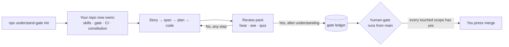

# Talk visual: what `npx understand-gate init` gives your repo

```mermaid
flowchart LR
  I["npx understand-gate init"] --> R["Your repo now owns:<br/>skills · gate · CI · constitution"]
  R --> S["Story → spec → plan → code"]
  S --> P["Review pack<br/>hear · see · quiz"]
  P -->|"No, any step"| S
  P -->|"Yes, after understanding"| L[("gate ledger")]
  L --> C{"human-gate<br/>runs from main"}
  C -->|"every touched scope has yes"| M["You press merge"]
```

Caption: **No yes without understanding. Enforced on GitHub, not by the agent.**
